## 1.1 Git简介

> **git是分布式版本控制系统**

```
版本控制：
- 分布式版本控制：没有“中央服务器”，每个开发人员电脑上都有一个完整的版本库。
- 集中式版本控制：版本库集中存放在中央服务器，必须要联网才能工作,没有历史版本库。
分布式优势：安全性更高，无需联网，若“中央服务器”故障，任何一个其他开发者本地都有最新的带历史记录的版本库。 
```

## 1.2 操作手册

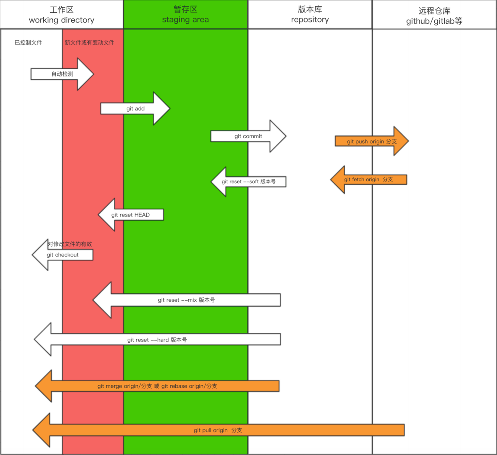

## cherry-pick

> 将指定的提交（[commit](https://so.csdn.net/so/search?q=commit&spm=1001.2101.3001.7020)）应用于其他分支。
>
> 详细使用：https://blog.csdn.net/qq_35432904/article/details/107232691

```
a - b - c - d   Master
         \
           e - f - g Feature
```

现在将提交`f`应用到`master`分支。

```
# 切换到 master 分支
$ git checkout master
 
# Cherry pick 操作
$ git cherry-pick f
```

## merge和rebase使用基本准则

1. 下游分支更新上游分支内容的时候使用 `rebase`
2. 上游分支合并下游分支内容的时候使用 `merge`
3. 更新当前分支的内容时一定要使用 `--rebase` 参数

例如现有上游分支 master，基于 master 分支拉出来一个开发分支 dev，在 dev 上开发了一段时间后要把 master 分支提交的新内容更新到 dev 分支，此时切换到 dev 分支，使用 `git rebase master`等 dev 分支开发完成了之后，要合并到上游分支 master 上的时候，切换到 master 分支，使用 `git merge dev`

## Rebase

> 顾名思义就是变基，改变基地址
>
> git rebase 产生冲突时，1、先解决冲突 2、git add 3、git commit 4、继续rebase：git rebase --continue。如果还是产生冲突继续解决冲突.....

三大应用场景：

- 多个记录合并为一个
- 

### 2.1 合并记录

>  多个记录合并成一个记录，不建议合并已push过的提交

```git
git rebase -i
```

例如要合并dcb这三个提交

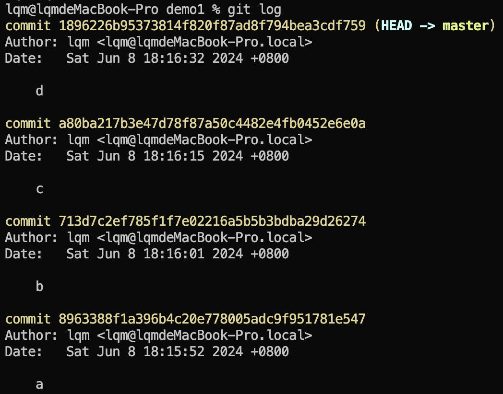

执行git rebase -i HEAD~3后，跳转到编辑页面

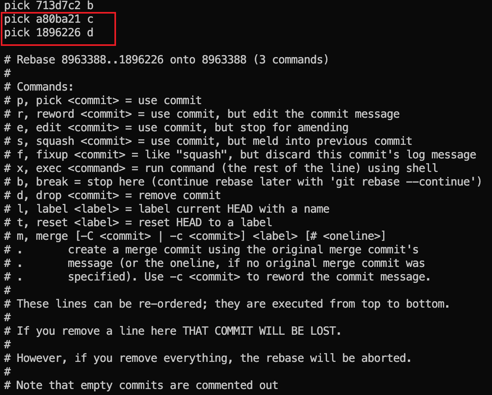

将红框后两个pick 改为squash，也可以简写改为s，意思是把这个commit合并到上一个提交，也就是说，`1896226`这个提交合并到`a80ba21`这个提交，然后`a80ba21`也是s，也要合并到上一个提交。

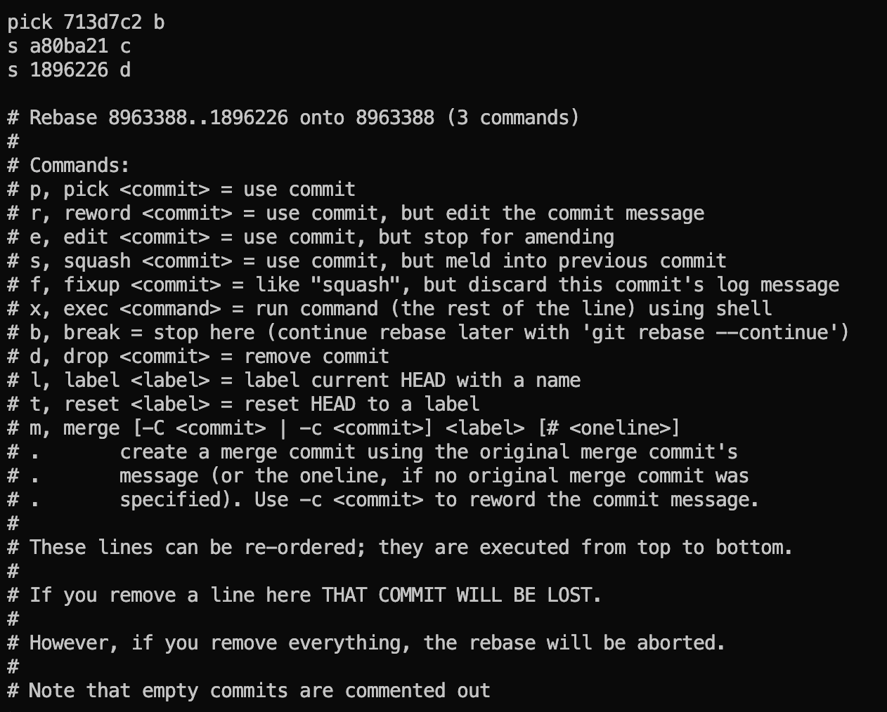

保存并退出后，自动跳转到commit提交信息页面也就是commit -m 信息，编辑提交信息

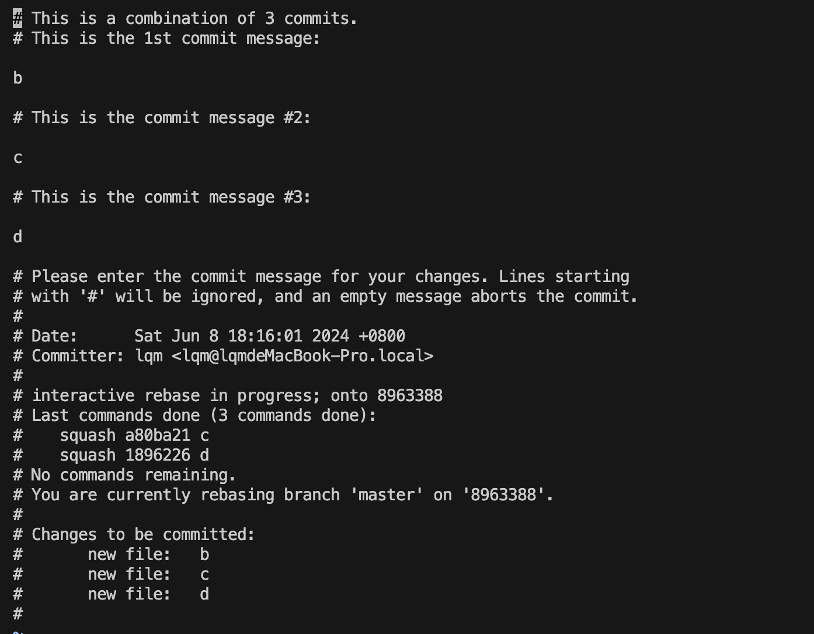

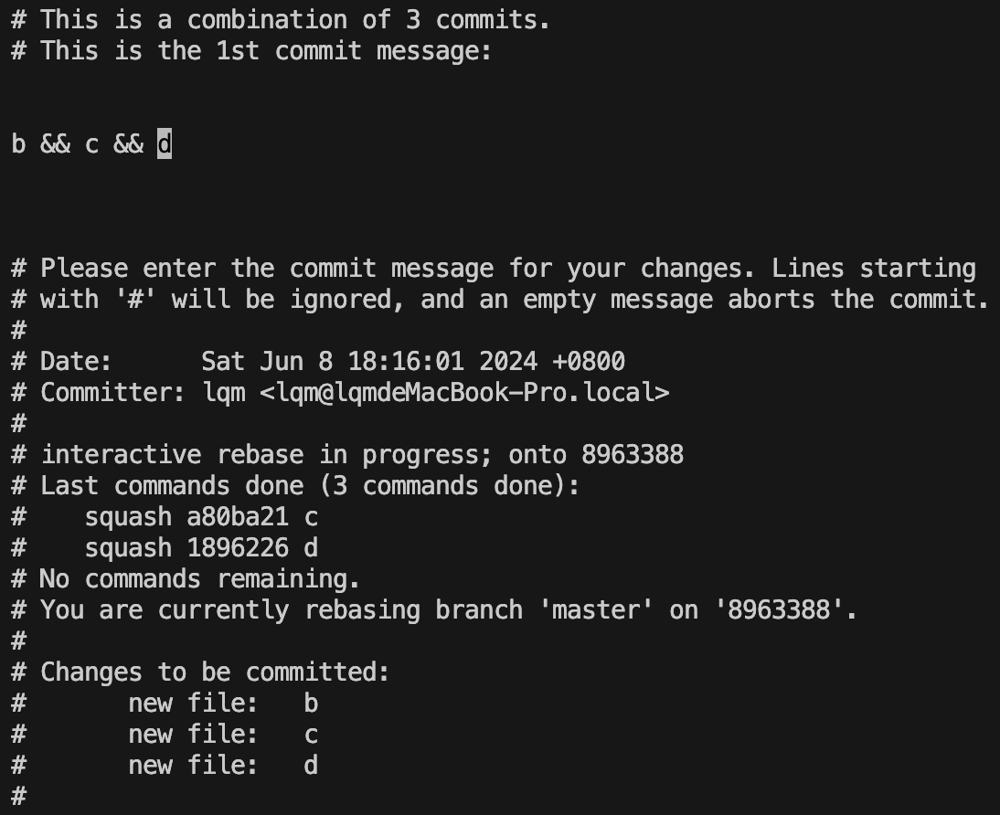

保存并退出，发现已经合并成功

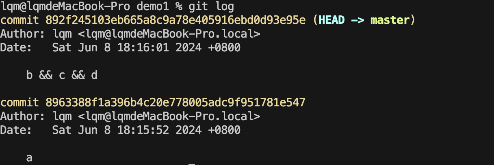


- 

- 

- 场景2：例如远程master分支 v1<--v2<--v5，本地分支 master v1<--v2<--v3<--v4

  本地分支没有v5，如果要push本地分支，需要pull在push，但是pull会报错

```shell
hint: You have divergent branches and need to specify how to reconcile them.
hint: You can do so by running one of the following commands sometime before
hint: your next pull:
hint:
hint:   git config pull.rebase false  # merge
hint:   git config pull.rebase true   # rebase
hint:   git config pull.ff only       # fast-forward only
hint:
hint: You can replace "git config" with "git config --global" to set a default
hint: preference for all repositories. You can also pass --rebase, --no-rebase,
hint: or --ff-only on the command line to override the configured default per
hint: invocation.
```

```shell
╭─qimeng@liuqimengdeMBP ~/test2/test1  ‹main›
╰─➤  git fetch origin main                                                128 ↵
From https://gitee.com/liuqimeng/test1
 * branch            main       -> FETCH_HEAD                                                       130 ↵
╭─qimeng@liuqimengdeMBP ~/test2/test1  ‹main›
╰─➤  git rebase origin/main                                               128 ↵
Successfully rebased and updated refs/heads/main
```

一、提交节点图解
首先通过简单的提交节点图解感受一下rebase在干什么

两个分支master和feature，其中feature是在提交点B处从master上拉出的分支

master上有一个新提交M，feature上有两个新提交C和D

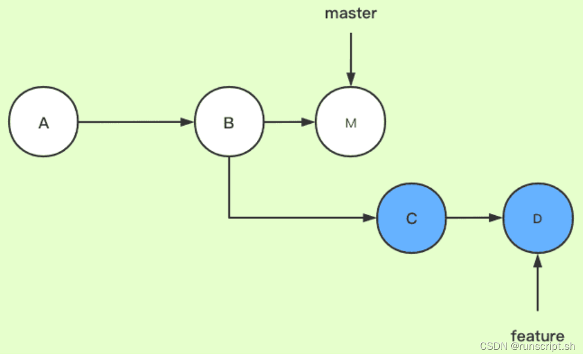

此时切换到feature分支上，执行如下命令，相当于是想要把master分支合并到feature分支（这一步的场景就可以类比为我们在自己的分支feature上开发了一段时间了，准备从主干master上拉一下最新改动）

```shell
git checkout feature
git rebase master

//这两条命令等价于git rebase master feature
```

下图为变基后的提交节点图，解释一下其工作原理：

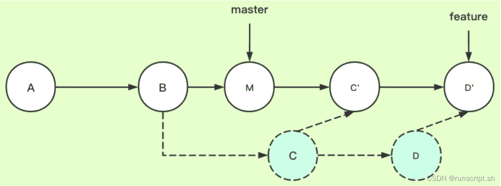

feature：待变基分支、当前分支
master：基分支、目标分支
官方解释（如果觉得看不懂可以直接看下一段）：当执行rebase操作时，git会从两个分支的共同祖先开始提取待变基分支上的修改，然后将待变基分支指向基分支的最新提交，最后将刚才提取的修改应用到基分支的最新提交的后面。

结合例子解释：当在feature分支上执行git rebase master时，git会从master和featuer的共同祖先B开始提取feature分支上的修改，也就是C和D两个提交，先提取到。然后将feature分支指向master分支的最新提交上，也就是M。最后把提取的C和D接到M后面，但这个过程是删除原来的C和D，生成新的C’和D’，他们的提交内容一样，但commit id不同。feature自然最后也是指向D’。

通俗解释（重要！！）：rebase，变基，可以直接理解为改变基底。feature分支是基于master分支的B拉出来的分支，feature的基底是B。而master在B之后有新的提交，就相当于此时要用master上新的提交来作为feature分支的新基底。实际操作为把B之后feature的提交存下来，然后删掉原来这些提交，再找到master的最新提交位置，把存下来的提交再接上去（新节点新commit id），如此feature分支的基底就相当于变成了M而不是原来的B了。（注意，如果master上在B以后没有新提交，那么就还是用原来的B作为基，rebase操作相当于无效，此时和git merge就基本没区别了，差异只在于git merge会多一条记录Merge操作的提交记录）

上面的例子可抽象为如下实际工作场景：张三从B拉了代码进行开发，目前提交了两次，开发到D了；李四也从B拉出来开发了并且开发完毕，他提交到了M，然后合到主干上了。此时张三想拉下最新代码，于是他在feature分支上执行了git rebase master，即把master分支给rebase过来，由于李四更早开发完并合了主干，如此就相当于张三是基于李四的最新提交M进行的开发了。

二、实际git提交示例
按照上面的图解构造了提交记录，如下图所示：（ABM是master分支线，ABCD是feature分支线。这里画成了master变色分叉出来，这不影响理解，知道是表示两个分支两条线即可！）

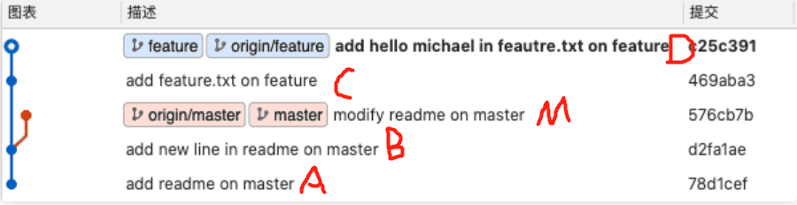

此时，在feature分支上执行git rebase master

变基完成以后，ABCD是原来的feature分支线，ABMC’D’是新的feature分支线，ABM是master分支线（没有变化）

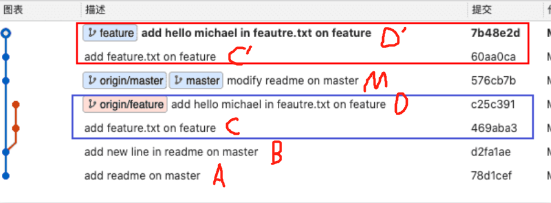


三、推荐使用场景


搞来搞去那么多，这其实是最重要的。不同公司，不同情况有不同使用场景，不过大部分情况推荐如下：

自己单机的时候，拉公共分支最新代码的时候使用rebase，也就是git pull -r或git pull --rebase。这样的好处很明显，提交记录会比较简洁。但有个缺点就是rebase以后我就不知道我的当前分支最早是从哪个分支拉出来的了，因为基底变了嘛，所以看个人需求了。
往公共分支上合代码的时候，使用merge。如果使用rebase，那么其他开发人员想看主分支的历史，就不是原来的历史了，历史已经被你篡改了。举个例子解释下，比如张三和李四从共同的节点拉出来开发，张三先开发完提交了两次然后merge上去了，李四后来开发完如果rebase上去（注意李四需要切换到自己本地的主分支，假设先pull了张三的最新改动下来，然后执行<git rebase 李四的开发分支>，然后再git push到远端），则李四的新提交变成了张三的新提交的新基底，本来李四的提交是最新的，结果最新的提交显示反而是张三的，就乱套了。
正因如此，大部分公司其实会禁用rebase，不管是拉代码还是push代码统一都使用merge，虽然会多出无意义的一条提交记录“Merge … to …”，但至少能清楚地知道主线上谁合了的代码以及他们合代码的时间先后顺序
四、总结
无论是个人开发，还是公司协作开发，只要没有特殊需求，用merge准没错！！

## stash临时存储区

> 当本地修改了一批代码，但是需要提交的只是修改中的部分文件或部分代码，可以将不需要提交的部分存入stash，push完之后pop出来继续开发。
>
> 另一个解释：将本地没提交的内容(`git commit`的内容不会被缓存 但`git add`的内容会被缓存)进行缓存并从当前分支移除，缓存的[数据结构](https://so.csdn.net/so/search?q=数据结构&spm=1001.2101.3001.7020)为堆栈，先进后出

```shell
# 将没有提交的内容缓存下来
╭─qimeng@liuqimengdeMBP ~/test  ‹dev*›
╰─➤  git stash
# 查看有哪些文件被缓存
╭─qimeng@liuqimengdeMBP ~/test  ‹dev*›
╰─➤  git stash show
# 查看缓存列表
╭─qimeng@liuqimengdeMBP ~/test  ‹dev*›
╰─➤  git stash list
# 恢复缓存（删除堆栈）
╭─qimeng@liuqimengdeMBP ~/test  ‹dev*›
╰─➤  git stash pop
# 恢复缓存（不删除堆栈）
╭─qimeng@liuqimengdeMBP ~/test  ‹dev*›
╰─➤  git stash apply
# 删除堆栈
╭─qimeng@liuqimengdeMBP ~/test  ‹dev*›
╰─➤  git stash drop xxx
```

## 从版本库中移除文件

> 也就是不让git管理了

```shell
╭─qimeng@liuqimengdeMBP ~/test  ‹main›
╰─➤  ls
aa.py
╭─qimeng@liuqimengdeMBP ~/test  ‹main›
╰─➤  git status
On branch main
nothing to commit, working tree clean
╭─qimeng@liuqimengdeMBP ~/test  ‹main›
╰─➤  git rm --cached aa.py
rm 'aa.py'
╭─qimeng@liuqimengdeMBP ~/test  ‹main*›
╰─➤  git status
On branch main
Changes to be committed:
  (use "git restore --staged <file>..." to unstage)
	deleted:    aa.py

Untracked files:
  (use "git add <file>..." to include in what will be committed)
	aa.py

╭─qimeng@liuqimengdeMBP ~/test  ‹main*›
╰─➤
```

## 从版本库中修改文件名

```shell
╭─qimeng@liuqimengdeMBP ~/test  ‹main›
╰─➤  touch a.py
╭─qimeng@liuqimengdeMBP ~/test  ‹main*›
╰─➤  git status
On branch main

No commits yet

Untracked files:
  (use "git add <file>..." to include in what will be committed)
	a.py

nothing added to commit but untracked files present (use "git add" to track)
╭─qimeng@liuqimengdeMBP ~/test  ‹main*›
╰─➤  git add .
╭─qimeng@liuqimengdeMBP ~/test  ‹main*›
╰─➤  git commit -m "test"
[main (root-commit) 251ea94] test
 1 file changed, 0 insertions(+), 0 deletions(-)
 create mode 100644 a.py
╭─qimeng@liuqimengdeMBP ~/test  ‹main›
╰─➤  git mv a.py aa.py
╭─qimeng@liuqimengdeMBP ~/test  ‹main*›
╰─➤  git status
On branch main
Changes to be committed:
  (use "git restore --staged <file>..." to unstage)
	renamed:    a.py -> aa.py

╭─qimeng@liuqimengdeMBP ~/test  ‹main*›
╰─➤  git commit -m "改名成功"
[main 4ac4e2d] 改名成功
 1 file changed, 0 insertions(+), 0 deletions(-)
 rename a.py => aa.py (100%)
╭─qimeng@liuqimengdeMBP ~/test  ‹main›
╰─➤
```

## 修改提交信息

> 目前我知道的两种用法
>
> - 修改最近一次commit -m 提交的描述信息
> - 将新文件加入到最近一次commit

```shell
╭─qimeng@liuqimengdeMBP ~/test  ‹main›
╰─➤  touch aa.py
╭─qimeng@liuqimengdeMBP ~/test  ‹main*›
╰─➤  git add .
╭─qimeng@liuqimengdeMBP ~/test  ‹main*›
╰─➤  git commit -m "第一次提交"
[main (root-commit) 2c8efd5] 第一次提交
 1 file changed, 0 insertions(+), 0 deletions(-)
 create mode 100644 aa.py
╭─qimeng@liuqimengdeMBP ~/test  ‹main›
╰─➤  git log
commit 2c8efd57346df64ca73d537aaa45ab41f2a86389 (HEAD -> main)
Author: 刘启萌 <3030373635@qq.com>
Date:   Sun Oct 16 16:40:15 2022 +0800

    第一次提交
# 用法一：执行git commit --amend 修改commit message信息
╭─qimeng@liuqimengdeMBP ~/test  ‹main›
╰─➤  git commit --amend
# 用法二：新增文件到上一次的commit中
╭─qimeng@liuqimengdeMBP ~/test  ‹main›
╰─➤  touch bb.py
╭─qimeng@liuqimengdeMBP ~/test  ‹main*›
╰─➤  git add .
╭─qimeng@liuqimengdeMBP ~/test  ‹main*›
╰─➤  git commit --amend
```

## 分支管理

```shell
# 查看已合并分支
╭─qimeng@liuqimengdeMBP ~/test  ‹main*›
╰─➤  git branch --merged
# 删除分支2
╭─qimeng@liuqimengdeMBP ~/test  ‹main*›
╰─➤  git branch -d xxx
# 删除分支2（强制删除）
╭─qimeng@liuqimengdeMBP ~/test  ‹main*›
╰─➤  git branch -D xxx
```

## 打标签

```shell
╭─qimeng@liuqimengdeMBP ~/test  ‹main*›
╰─➤  git tag v1.0
```

## 生成代码压缩包

```shell
╭─qimeng@liuqimengdeMBP ~/test  ‹main*›
╰─➤  git archive branch........
```

## 自动部署到web服务器

> Webhook
>
> 在github设置钩子后，push代码到github后，github会访问我们指定的钩子，从而达到更新代码

## 常用命令

```shell
git checkout -b qimeng.liu-dev remote/origin/qimeng.liu-dev

Git branch -d 或者-D

Git branch -a