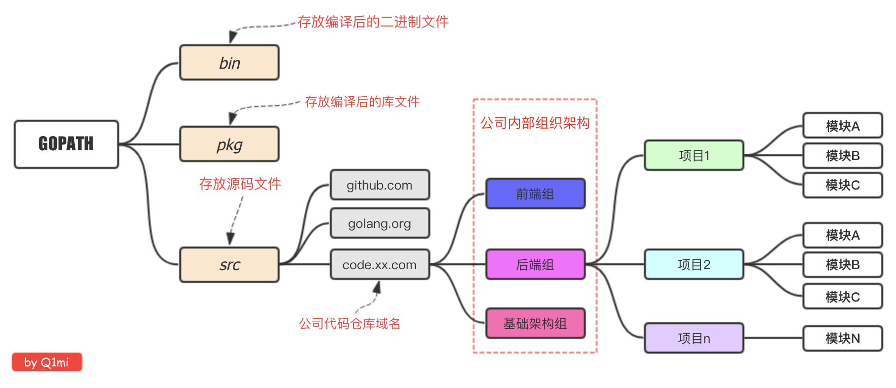

**Notes：go 1.11 之前使用GOPATH进程项目管理，go 1.11 之后使用GOMODULE进行项目管理**

# 一、安装

> https://golang.google.cn/dl/

## 1.1 Mac

下载安装包安装，默认安装路径：/usr/local/go

## 1.2 Windows

下载安装包安装，自定义安装路径

## 1.3 Linux

下载tar.gz包，解压在自定义路径

# 二、配置环境

## 1.1 mac

~/.zshrc文件新增如下几项

```shell
#GOROOT：go的安装路径
export GOROOT=/usr/local/go

#GOPATH：存放go代码的路径，需要自己创建，在该目录下创建3个文件夹，bin：用于存放编译后的可执行文件。pkg：用于存放编译后的包文件。src：用于存放go项目代码。
export GOPATH=/Users/qimeng/Documents/work/GoProjects
```

# 三、GOPATH项目结构

## 3.1 适用于个人

Go语言中也是通过包来组织代码文件，我们可以引用别人的包也可以发布自己的包，但是为了防止不同包的项目名冲突，我们通常使用`顶级域名`来作为包名的前缀，这样就不担心项目名冲突的问题了。

因为不是每个个人开发者都拥有自己的顶级域名，所以目前流行的方式是使用个人的github用户名来区分不同的包。

## 3.2 适用于企业



# 四、跨平台

默认`go build`的可执行文件都是当前操作系统可执行的文件，如果我想在windows下编译一个linux下可执行文件，那需要怎么做呢？

只需要指定目标操作系统的平台和处理器架构即可：

```bash
SET CGO_ENABLED=0  // 禁用CGO
SET GOOS=linux  // 目标平台是linux
SET GOARCH=amd64  // 目标处理器架构是amd64
```

*使用了cgo的代码是不支持跨平台编译的*

然后再执行`go build`命令，得到的就是能够在Linux平台运行的可执行文件了。

```bash
# 编译windows
go env -w CGO_ENABLED=0
go env -w GOOS=windows
go env -w GOARCH=amd64
# 编译linux
go env -w CGO_ENABLED=0
go env -w GOOS=linux
go env -w GOARCH=amd64
# 编译mac
go env -w CGO_ENABLED=0
go env -w GOOS=darwin
go env -w GOARCH=amd64
```
