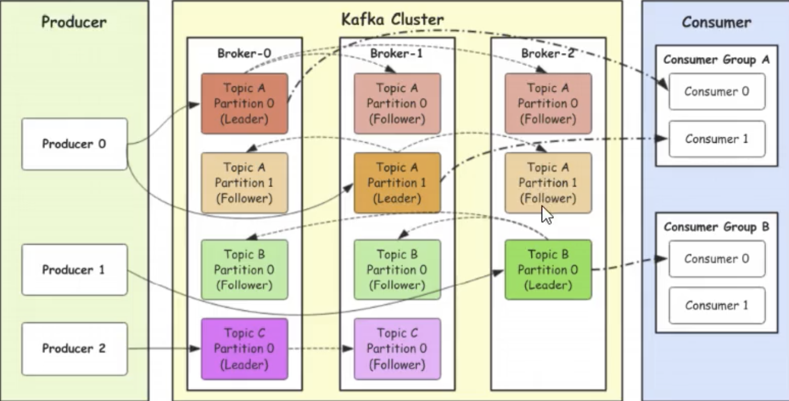
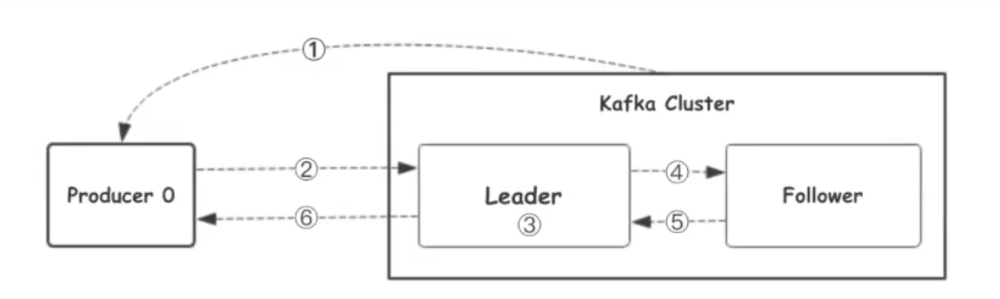

1. kafka集群的架构
   1. broker：集群节点
   2. topic：消息主题
   3. partition：主题分区，把同一个topic分成多个分区，提高负载
      1. leader：分区的主节点（老大）
      2. follower：分区的从节点（小弟）
   4. Consumer Group：消费组，也可以由一个消费者组成

2. 生产者往kafka发送数据的流程（6步）

   1. 生产者从kafka集群获取分区leader信息
   2. 生产者将消息发送给leader，下面的3、4、5、6取决于

   3. leader将消息写入本地磁盘
   4. follower从leader拉取消息数据
   5. follower将消息写入本地磁盘后向leader发送ack
   6. leader收到所有的flower的ack之后向生产者发送ack

3. 分区选择原则（3种）
   1. 指定写入分区
   2. 如果没有指定，但是设置了数据key，kafka会根据key，hash一个分区
   3. 如果没有指定分区，也没有设置key，会采用轮训方式，即每次取一小段时间的数据写入随机分区，下一段时间写入下一个随机分区

4. 生产者向kafka发送消息的模式（3种）

   1. 0代表数据发送给leader就成功，安全性最低，效率最快

   1. 1代表数据发送给leader，leader返回ACK就成功

   1. all代表数据发送给leader，follower从leader拉取消息回复ACK给leader，leader在返回ACK，安全性最高，效率最慢

# Partition结构

> 分区在服务器上就是一个一个的文件夹，每个文件夹下面会有多组segment文件，每组segment文件又包含`.index` `.log` `.timeindex`文件，`.log`为存储message文件，另外两个存储索引信息，用于检索文件

