# 二、HTTPS

> Htpps的s表示使用ssl/tls协议，ssl/tls使用pki技术

对称加密的优点是运算速度快，缺点是互联网环境下无法将密钥安全的传送给对方。非对称加密的优点是可以安全的将公钥传递给对方，但是运算速度慢。所以TLS使用混合加密来保证传输数据的安全高效。

混合加密一共有两个阶段：

- 密匙交换：使用非对称加密交换秘钥
- 数据加密：使用秘钥加密

密匙交换常用算法：

- RSA
- ECDHE

## 2.1 历史发展

> TLS由SSL更新迭代而来

## 2.2 协议架构

报文中的前几个字段的描述， 这是每个TLS包文，都会拥有的参数

- ContentType type：表示当前的协议类型， 比如握手协议，警告协议。
- ProtocolVersion version：表示当前TLS的协议版本。
- Length：表示接下来的数据段(fragment)的尺寸大小。
- Fragment: 用于填充TLS协议的各类子协议内容和应用的通信数据。

### Handshake Protocol

> 握手协议：
>
> - 通信双方身份验证
> - 协商加密算法，交换秘钥

### Record Protocol

> 记录协议：
>
> - 数据封装，压缩，加密，完整性校验

### CCS Protocol

> 密码规则变更协议
>
> - 确认启动协商好的密钥

### Alert Protocol

> 告警协议
>
> - 通信过程中的错误处理

## 2.3 RSA

> RSA 是比较传统的密钥交换算法，它不具备前向安全的性质，因此现在很少服务器使用的，现在主流ECDHE密钥交换算法

下面通过 Wireshark 抓包，具体讲一下 SSL/TLS 1.2 四次握手的过程。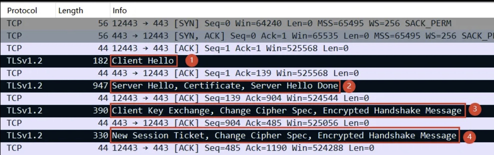

**第一次握手** 

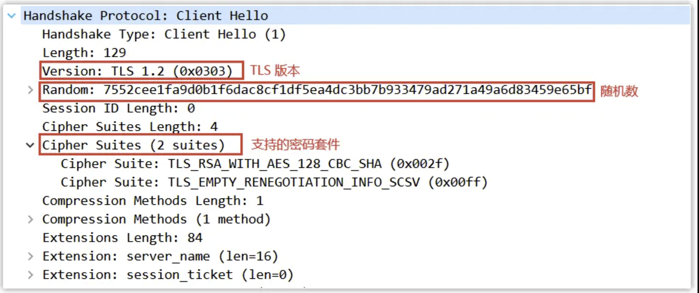

客户端向服务器发起加密通信请求 ，内容主要包括：

1. 客户端支持的 SSL/TLS 协议版本，如 TLS 1.2 版本。
2. 客户端生产的随机数 1，用于后续生成`会话密钥`和`鉴别密钥`。
3. 客户端支持的密码套件列表

**第二次握手** 

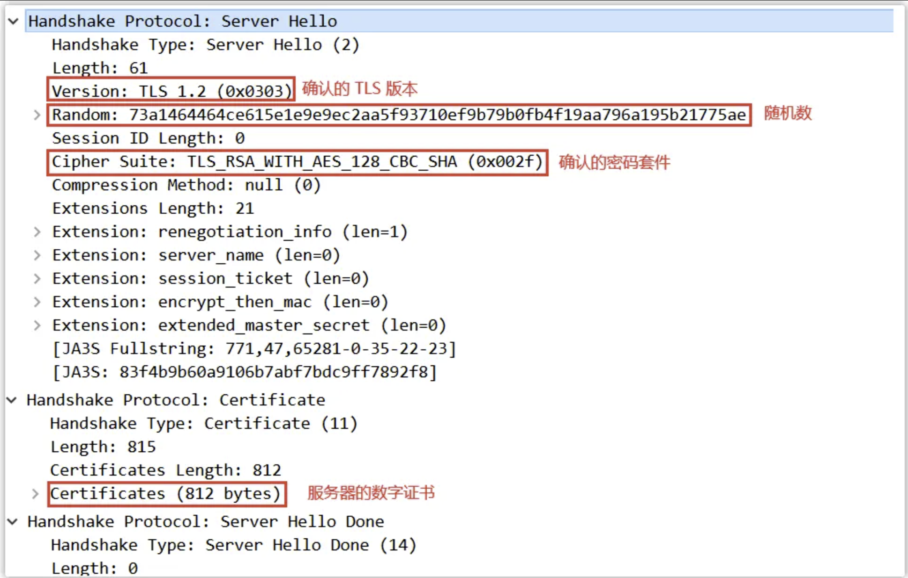

服务器收到客户端加密通信请求后，向客户端发出响应，内容主要包括：

1. 确认的 SSL/ TLS 协议版本，如果双方支持的版本不同，则关闭加密通信。
2. 服务器生产的随机数 ，用于后续生成`会话密钥`和`鉴别密钥`。
3. 确认的密码套件，如 TLS_RSA_WITH_AES128_CBC_SHA。
   1. `用于传输会话密钥的非对称加密算法`，如 ECDHE、RSA；
   2. `用于验证数字证书的非对称加密算法`，如 ECDHE、RSA；
   3. `用于传输数据的对称加密算法`，如 AES_128_GCM、AES_128_CBC；
   4. `用于验证报文完整性的摘要算法`，如 SHA256、SHA384；
   5. 格式为：**密钥交换算法 + 签名算法 + 对称加密算法 + 摘要算法**
4. 服务器的数字证书。

**第三次握手** 

客户端收到服务器的回应之后，会验证其数字证书是否合法（验证方法在数字证书小节中有说明），如果证书合法，则进行第三次握手，内容主要包括：

1. 客户端生产的另一个随机数 3（称为前主密钥，Pre-Master Secret，简写为 PMS），此随机数会被服务器`公钥`加密。**注意：如果服务器私钥泄露，前主秘钥就会被解开，随机数1和2又是明文传输的，加上前主秘钥就可以生成对称秘钥**

   客户端根据随机数 1、随机数 2 以及前主密钥计算出主密钥（Master Secret，MS），接着将主密钥切片得到两个`会话密钥`和两个`鉴别密钥`。

2. 加密通信算法改变通知，表示之后数据都将用`会话密钥`进行加密。

3. 客户端握手结束通知，表示客户端的握手阶段已经结束。客户端会生成所有握手报文数据的摘要，并用`会话密钥`加密后发送给服务器，用来供服务端校验。

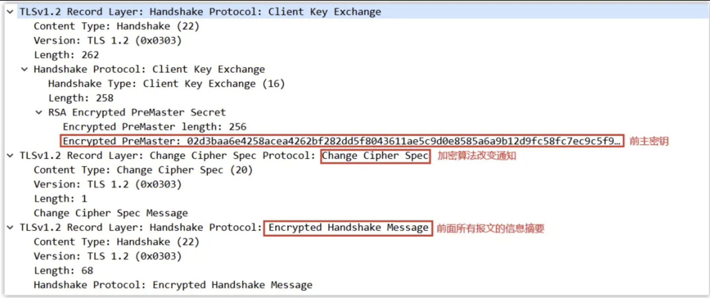

**第四次握手** 

服务器收到客户端的消息后，利用自己的`私钥`解密出前主密钥，并根据随机数 1、随机数 2 以及前主密钥计算出主密钥，接着将主密钥切片得到两个`会话密钥`和两个`鉴别密钥`。

之后进行第四次握手，内容主要包括：

1. 加密通信算法改变通知，表示之后数据都将用`会话密钥`进行加密。
2. 服务器握手结束通知，表示服务器的握手阶段已经结束。服务器会生成所有握手报文数据的摘要，并用`会话密钥`加密后发送给客户端，用来供客户端校验。

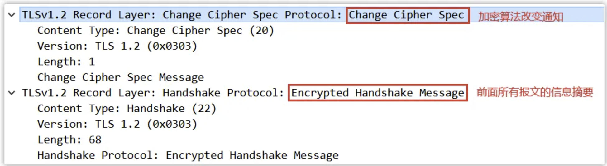

至此，整个 SSL/TLS 的握手阶段全部结束！

**为什么第三、第四次握手要发送所有握手报文的摘要呢？**

主要原因是**防止握手信息被篡改**。比如客户端支持的密码套件列表中，有些加密算法较弱，有些加密算法较强，而此密码套件是明文传输的，万一黑客将此密码套件列表进行了修改，只留下一些安全性较低的加密算法，那么服务器就只能从这些安全性较低的加密算法中选择，安全性大大降低。因此需要通过发送摘要的形式防止握手信息被篡改。

**为什么不直接发送一个主密钥，而是用两个随机数加一个前主密钥重新生成一个主密钥呢？**

主要原因是**防止连接重放**。如果没有前面两个随机数，仅仅由客户端生成一个主密钥，并通过服务器`公钥`加密发送给服务器。那么黑客在嗅探了服务器与客户端之间的所有报文后，可以再次冒充客户端向服务器发送相同的报文（虽然黑客不知道内容是什么），因为报文信息都是之前客户端和服务器验证过的，因此服务器会认为是客户端与其通信，导致又一次连接。

假如服务器是一个购物网站，那么此连接重放会导致客户端再一次下单，造成损失。

而如果有了前两个随机数，即使黑客冒充客户端想要连接重放，然而**由于随机数不同，生成的密钥则不同**，黑客重新发送的内容将失效（服务器不能理解、完整性摘要也不对）。

**RSA 算法的缺陷**

**使用 RSA 密钥协商算法的最大问题是不支持前向保密**。因为客户端传递随机数（用于生成对称加密密钥的条件之一）给服务端时使用的是公钥加密的，服务端收到到后，会用私钥解密得到随机数。所以一旦服务端的私钥泄漏了，过去被第三方截获的所有 TLS 通讯密文都会被破解。

## 2.4 ECDHE

知道了 ECDHE 算法基本原理后，我们就结合实际的情况来看看。 

我用 Wireshark 工具抓了用 ECDHE 密钥协商算法的 TSL 握手过程，可以看到是四次握手：

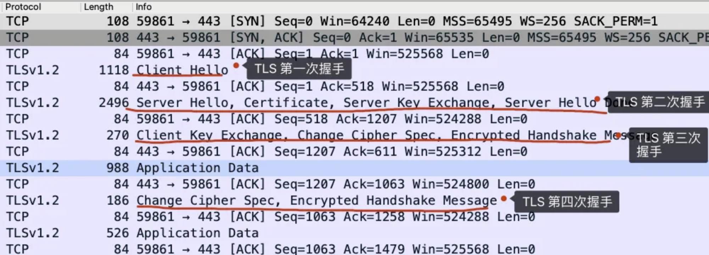

细心的小伙伴应该发现了，**使用了 ECDHE，在 TLS 第四次握手前，客户端就已经发送了加密的 HTTP 数据**，而对于 RSA 握手过程，必须要完成 TLS 四次握手，才能传输应用数据。

所以，**ECDHE 相比 RSA 握手过程省去了一个消息往返的时间**，这个有点「抢跑」的意思，它被称为是「*TLS False Start*」，跟「*TCP Fast Open*」有点像，都是在还没连接完全建立前，就发送了应用数据，这样便提高了传输的效率。

接下来，分析每一个 ECDHE 握手过程。

#### TLS 第一次握手

客户端首先会发一个「**Client Hello**」消息，消息里面有客户端使用的 TLS 版本号、支持的密码套件列表，以及生成的**随机数（\*Client Random\*）**。个人理解：这里的随机数是客户端椭圆曲线私钥

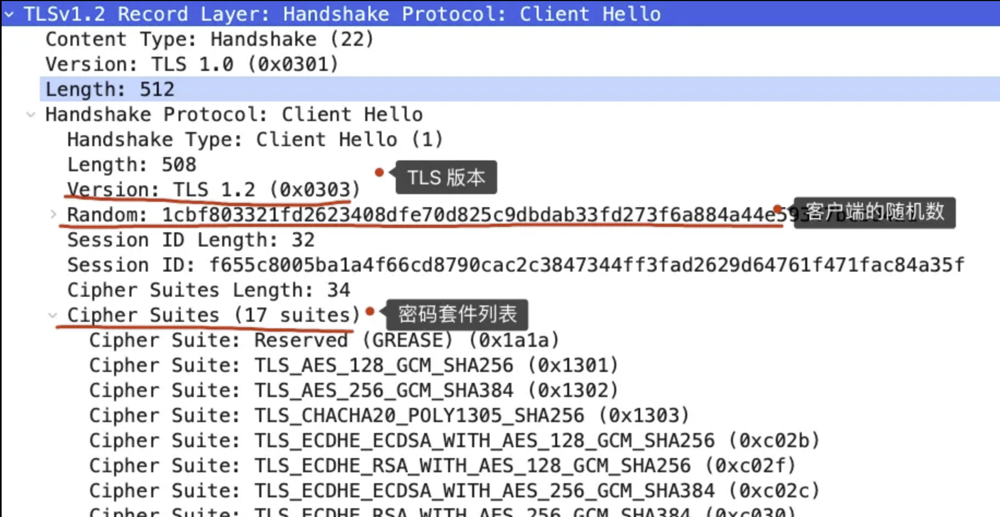

#### TLS 第二次握手

服务端收到客户端的「打招呼」，同样也要回礼，会返回「**Server Hello**」消息，消息面有服务器确认的 TLS 版本号，也给出了一个**随机数（\*Server Random\*）**，然后从客户端的密码套件列表选择了一个合适的密码套件。个人理解：这里的随机数是服务端椭圆曲线私钥

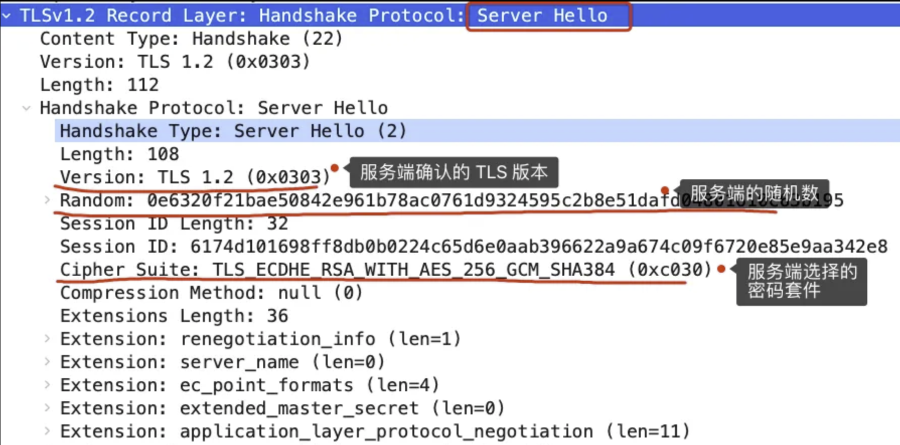

不过，这次选择的密码套件就和 RSA 不一样了，我们来分析一下这次的密码套件的意思。

「 TLS_ECDHE_RSA_WITH_AES_256_GCM_SHA384」

- 密钥协商算法使用 ECDHE；
- 签名算法使用 RSA；
- 握手后的通信使用 AES 对称算法，密钥长度 256 位，分组模式是 GCM；
- 摘要算法使用 SHA384；

接着，服务端为了证明自己的身份，发送「**Certificate**」消息，会把证书也发给客户端。

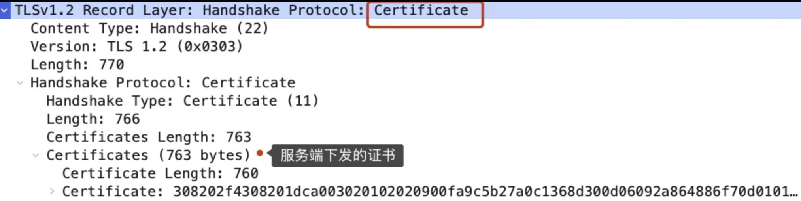

这一步就和 RSA 握手过程有很大到区别了，因为服务端选择了 ECDHE 密钥协商算法，所以会在发送完证书后，发送「**Server Key Exchange**」消息。

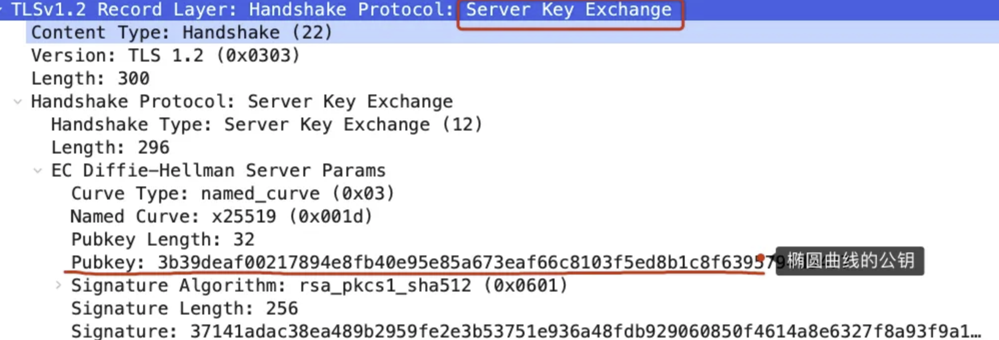

这个过程服务器做了三件事：

- 选择了**名为 named_curve 的椭圆曲线**，选好了椭圆曲线相当于椭圆曲线基点 G 也定好了，这些都会公开给客户端；
- 生成随机数作为服务端椭圆曲线的私钥，保留到本地；
- 根据基点 G 和私钥计算出**服务端的椭圆曲线公钥**，这个会公开给客户端。

为了保证这个椭圆曲线的公钥不被第三方篡改，服务端会用 RSA 签名算法给服务端的椭圆曲线公钥做个签名。

随后，就是「**Server Hello Done**」消息，服务端跟客户端表明：“这些就是我提供的信息，打招呼完毕”。

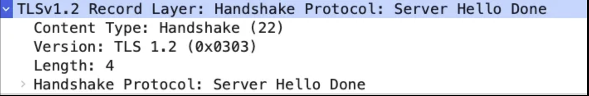

至此，TLS 两次握手就已经完成了，目前客户端和服务端通过明文共享了这几个信息：**Client Random、Server Random 、使用的椭圆曲线、椭圆曲线基点 G、服务端椭圆曲线的公钥**，这几个信息很重要，是后续生成会话密钥的材料。

#### TLS 第三次握手

客户端收到了服务端的证书后，自然要校验证书是否合法，如果证书合法，那么服务端到身份就是没问题的。校验证书到过程，会走证书链逐级验证，确认证书的真实性，再用证书的公钥验证签名，这样就能确认服务端的身份了，确认无误后，就可以继续往下走。

客户端会生成一个随机数作为客户端椭圆曲线的私钥，然后再根据服务端前面给的信息，生成**客户端的椭圆曲线公钥**，然后用「**Client Key Exchange**」消息发给服务端。

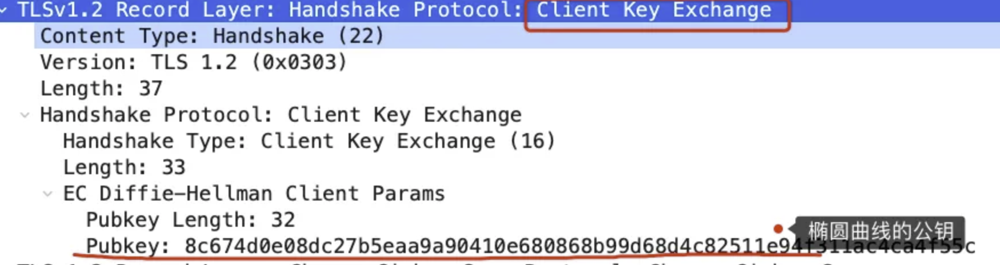

至此，双方都有对方的椭圆曲线公钥、自己的椭圆曲线私钥、椭圆曲线基点 G。于是，双方都就计算出点（x，y），其中 x 坐标值双方都是一样的，前面说 ECDHE 算法时候，说 x 是会话密钥，**但实际应用中，x 还不是最终的会话密钥**。x也叫做预主秘钥。

还记得 TLS 握手阶段，客户端和服务端都会生成了一个随机数传递给对方吗？

**最终的会话密钥，就是用「客户端随机数 + 服务端随机数 + x（ECDHE 算法算出的共享密钥） 」三个材料生成的**。

之所以这么麻烦，是因为 TLS 设计者不信任客户端或服务器「伪随机数」的可靠性，为了保证真正的完全随机，把三个不可靠的随机数混合起来，那么「随机」的程度就非常高了，足够让黑客计算出最终的会话密钥，安全性更高。

算好会话密钥后，客户端会发一个「**Change Cipher Spec**」消息，告诉服务端后续改用对称算法加密通信。

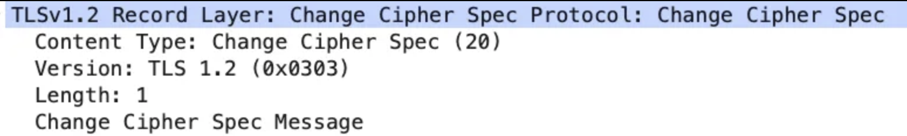

接着，客户端会发「**Encrypted Handshake Message**」消息，把之前发送的数据做一个摘要，再用对称密钥加密一下，让服务端做个验证，验证下本次生成的对称密钥是否可以正常使用。

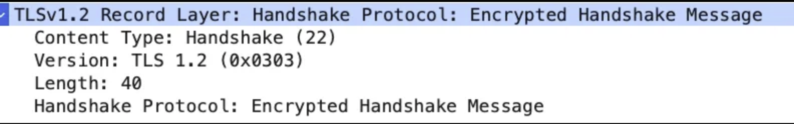

#### TLS 第四次握手

最后，服务端也会有一个同样的操作，发「**Change Cipher Spec**」和「**Encrypted Handshake Message**」消息，如果双方都验证加密和解密没问题，那么握手正式完成。于是，就可以正常收发加密的 HTTP 请求和响应了。

## 2.5 总结

RSA 和 ECDHE 握手过程的区别：

- RSA 密钥协商算法「不支持」前向保密，ECDHE 密钥协商算法「支持」前向保密；
- 使用了 RSA 密钥协商算法，TLS 完成四次握手后，才能进行应用数据传输，而对于 ECDHE 算法，客户端可以不用等服务端的最后一次 TLS 握手，就可以提前发出加密的 HTTP 数据，节省了一个消息的往返时间；
- 使用 ECDHE， 在 TLS 第 2 次握手中，会出现服务器端发出的「Server Key Exchange」消息，而 RSA 握手过程没有该消息；

ECDHE 密钥交换：
主要通过 Server Key Exchange 和 Client Key Exchange 来交换，其中 Server Key Exchange 是用来发送服务器椭圆曲线算法的参数、公钥信息以及该信息的签名，Client Key Exchange 用来发送客户端椭圆曲线算法的公钥信息，双方得到对方椭圆曲线算法公钥之后，与自己本地生成的临时私钥，通过椭圆曲线算法生成预主密钥，再导出主密钥和会话密钥，握手完成之后通过会话密钥来加密通信。
