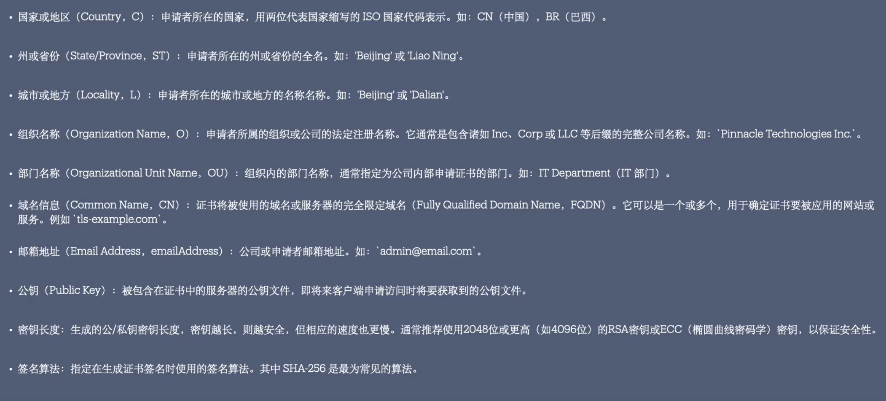

申请证书的大致流程：创建PKI密钥对，创建CSR文件，使用CSR文件请求CA机构

## CSR文件

证书签名请求（Certificate Signing Request，简称 CSR）是申请数字证书时生成的一个文件。它包含有关申请者的信息，并由申请者的私钥签名。CSR 用于请求证书颁发机构（CA）颁发一个与请求者信息匹配的数字证书。以下是 CSR 中通常包含的关键信息：



### 介绍

**公钥 (Public Key)**

- CSR 包含了申请者的公钥，该公钥与申请者的私钥配对。
- CA 会使用这个公钥创建证书。

**主题名称 (Subject Name)**

- 包含有关申请者的信息。通常包括以下字段：
  - **常用名称 (Common Name, CN)：** 申请者的域名或组织名。
  - **组织 (Organization, O)：** 申请者所属的公司或机构。
  - **组织单位 (Organizational Unit, OU)：** 申请者所属的部门或业务单位。
  - **城市/地方 (Locality, L)：** 申请者所在的城市或区域。
  - **州/省 (State, ST)：** 申请者所在的州或省。
  - **国家 (Country, C)：** 申请者所在的国家代码（如：CN, US, DE）。

**密钥算法 (Key Algorithm)**

- 指明使用的加密算法（如 RSA、ECDSA），以及密钥长度（如 2048、4096 位）。

**附加信息**

- 可以包含备用名称 (Subject Alternative Name, SAN) 列表，如多个域名或子域。
- 特定用途的扩展字段，表示证书的预期用途（例如，服务器认证、客户端认证等）。

**数字签名**

- 使用私钥对CSR内容进行加密，确保数据的完整性和真实性。

### 命令行创建

- 在线创建
- 本地创建
  - openssl（推荐）
  - cfssl

**交互式创建**

```shell
openssl req -new -key private.pem -out example.csr
```

此时会提示你输入以下信息：

- **Country Name (2 letter code) [AU]:** 国家代码，如中国为 `CN`。
- **State or Province Name (full name) [Some-State]:** 州或省名。
- **Locality Name (eg, city) []:** 城市名。
- **Organization Name (eg, company) [Internet Widgits Pty Ltd]:** 公司的正式名称。
- **Organizational Unit Name (eg, section) []:** 部门名称（可选）。
- **Common Name (e.g. server FQDN or YOUR name) []:** 完全限定域名（FQDN），如 `www.example.com`。
- **Email Address []:** 联系邮箱地址。
- **A challenge password []:** 挑战密码（可留空）。
- **An optional company name []:** 可选公司名称（可留空）。

输入完所有信息后，将生成 `example.csr` 文件。

生成CSR后，可以通过以下命令检查CSR文件内容以确保信息正确：

```shell
openssl req -noout -text -in example.csr
```

**传参创建**

```shell
openssl req -new -key private.pem -out example.csr \
  -subj "/C=CN/ST=Beijing/L=Beijing/O=Example Company/OU=IT Department/CN=www.example.com/emailAddress=admin@example.com"
```

### 配置文件创建

### 同时创建PKI秘钥以及CSR文件

```shell
openssl req -new \
-keyout private.pem \
-nodes \ # 不为秘钥创建秘钥
-out cert.csr \
-subj "/C=CN/ST=Beijing/L=Beijing/O=Example Company/OU=IT Department/CN=www.example.com/emailAddress=admin@example.com"
```


## PKI密钥

在 PKI 中，密钥分为两种：**公钥**和**私钥**。这两个密钥共同构成了非对称加密的基础。以下是它们各自的作用：

1. **公钥**

- **加密**：公钥用于加密信息，任何人都可以使用公钥对信息进行加密，但只有对应的私钥持有者才能解密。
- **验证签名**：公钥也用于验证数字签名。一个签名是用私钥创建的，公钥可以验证签名的真实性和完整性。
- **公开发布**：公钥是公开的，可以分发给任何需要与持有者安全通信的人或实体。

2. **私钥**

- **解密**：私钥用于解密由公钥加密的信息，确保只有授权的持有者可以访问加密数据。
- **创建签名**：私钥用于创建数字签名，以验证发送者的身份并确保信息未被篡改。
- **保密性**：私钥必须严格保密，不能被他人获取或复制。

创建公钥私钥最常见以下算法：

- RSA：目前使用最广泛
- ASD：因为安全性问题，不在推荐
- ECDSA：目前仍未被广泛使用
- EdDSA：目前仍未被广泛使用

选择密钥大小：密钥越长越安全，同时解密需要花费时间也变长了，对于RSA至少要确保2028位。

密钥密码：为创建的密钥指定一个密码，进一步保护密钥对。

有两个子命令可以创建密钥对。无论使用哪个创建的效果都是一样的，这里我们创建RSA密钥对

- genpkey
- genras

### genpkey

> 创建 RSA 密钥对

1. 生成私钥

```shell
lqm@lqmdeMacBook-Pro ~ % openssl genpkey -algorithm RSA -out private_key.pem -pkeyopt rsa_keygen_bits:2048
```

这将生成一个私钥文件 `private_key.pem`。可以通过指定 `-aes256` 来加密该私钥：

```shell
lqm@lqmdeMacBook-Pro ~ % openssl genpkey -algorithm RSA -out private_key.pem -aes256 -pkeyopt rsa_keygen_bits:2048
```

系统会提示你输入加密该私钥的密码。

2. 从私钥导出公钥

使用生成的私钥文件创建公钥文件：

```shell
lqm@lqmdeMacBook-Pro ~ % openssl rsa -pubout -in private_key.pem -out public_key.pem
```

这将从 `private_key.pem` 中提取公钥并保存到 `public_key.pem` 中。

### genras

> 创建 RSA 密钥对

1. 生成私钥

```shell
lqm@lqmdeMacBook-Pro ~ % openssl genrsa -out private.pem 4096
```

2. 从私钥导出公钥

```shell
lqm@lqmdeMacBook-Pro ~ % openssl rsa -in private.pem -pubout -out public.pem
```

### 检查密钥文件

- 查看私钥

  可以检查私钥的详细信息：

  ```shell
  lqm@lqmdeMacBook-Pro ~ % openssl rsa -in private_key.pem -text -noout # 加-check参数可以查看是否有效
  ```

- 查看公钥

  可以公钥的详细信息：

  ```shell
  lqm@lqmdeMacBook-Pro ~ % openssl rsa -pubin -in public_key.pem -text -noout
  ```

## x509标准

> 用于定义公钥证书的格式和语义。它是公钥基础设施（PKI）的核心组件，支持互联网安全协议如 SSL/TLS、S/MIME、IPsec 和电子签名。X.509 证书用于确保信息的机密性、完整性和身份验证。

1. **版本号 (Version)**

指定证书的 X.509 版本号。目前，常用的是版本 3。

2. **序列号 (Serial Number)**

由证书颁发机构 (CA) 分配的唯一编号，用于标识证书。

3. **签名算法标识符 (Signature Algorithm Identifier)**

指定 CA 用于签名证书的算法，例如 `sha256WithRSAEncryption`。

4. **颁发者信息 (Issuer Name)**

表示颁发证书的 CA 的身份信息，包括名称和标识。

5. **有效期 (Validity)**

包括两个日期字段：**开始日期 (Not Before)** 和 **截止日期 (Not After)**，定义证书的有效期。

6. **主体信息 (Subject Name)**

表示证书持有者的身份信息，包括组织名称、域名等。

7. **主体公钥信息 (Subject Public Key Info)**

包含证书持有者的公钥及其算法标识符。

8. **扩展字段 (Extensions)**

- 可选字段，用于增加证书的功能和用途。X.509 v3 支持多种扩展，例如：
  - **密钥用法 (Key Usage)**：指定公钥的用途（例如，数字签名、密钥加密）。
  - **扩展密钥用法 (Extended Key Usage)**：指定更具体的用途（例如，服务器身份验证）。
  - **主题备用名称 (Subject Alternative Name, SAN)**：允许为证书指定多个主体名称（例如多个域名）。
  - **基本约束 (Basic Constraints)**：指定证书是否可以用作 CA 证书。
  - **CRL 分布点 (CRL Distribution Points)**：指定证书撤销列表的位置。

9. **签名 (Signature)**

CA 使用其私钥对证书数据部分进行签名，以验证证书的真实性和完整性。