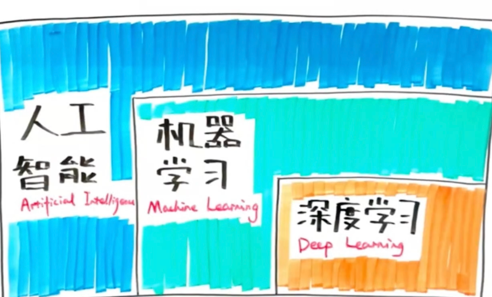

---
title:AI
---

> AI也叫人工智能，旨让计算机系统去模拟人类的智能，从而解决问题和完成任务

## 一、机器学习

> 机器学习是AI的一个子集，不需要人类做显示编程，而是让算机通过算法自行学习和改进

### 监督学习

提供数据并提供数据对应结果的机器学习过程

### 无监督学习

提供数据并且不提供数据对应结果的机器学习过程

### 半监督学习

训练数据包括少量的结果

### 强化学习

根据每次结果收获的奖惩进行学习，实现优化

