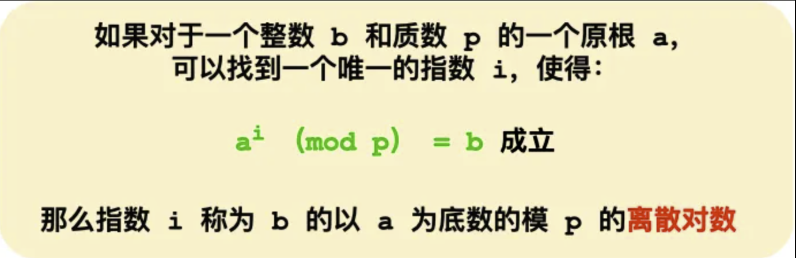

# 一、对称加密

加密和解密都用同一把秘钥

优点：

- 速度快
- 安全
- 紧凑

缺点：

- 互联网上明文传输秘钥，容易被劫持
- 随着参与者数量增加，秘钥数量急剧膨胀
- 随着秘钥变多，对秘钥的存储以及管理愈发困难
- 不支持数字签名和身份验证

应用：因为速度非常快，一般用于数据的加密传输

# 二、非对称加密

一共使用两个秘钥完整数据加密解密过程，一个是公钥，一个是私钥，其中一个加密，另外一个只能解密。

针对使用公钥加密与私钥加密，分两种叫法。

- 当公钥加密时，叫做加密
- 当私钥加密时，叫做签名，一般用于身份验证。

优点：

- 安全
- 不必担心，秘钥被劫持
- 支持数字签名

缺点：

- 非常慢，比对称加密约慢1000倍
- 密文会变长

应用：因为速度太慢，一般用于两块地方，

- 秘钥交换
- 数字签名

## 2.1 RSA

第一步：任意找两个质数，p=3，q=11

第二步：N = p * q = 33

第三步：欧拉函数 T = (p - 1) * (q - 1) = 20

第四步：选公钥E：要求是质数;1 < E < T;不是T的因子，这里选择3

第五步：算私钥D：(D * E) % T = 1  （7*3）% 20 = 1，这里私钥为7

假设待发送数据为m

加密过程：m ^E % N  = C，假设需要发送数据2，2^3 % 33 = 6，密文为8

解密过程：C^D % N = m，8^7 % 33 = 2

数学就是这么神奇，我也不知道原理。

## 2.2 DH

该算法的核心数学思想是**离散对数**。

是不是听到这个数学概念就怂了？不怕，这次不会说离散对数推到的过程，只简单提一下它的数学公式。

离散对数是「离散 + 对数」的两个数学概念的组合，所以我们先来复习一遍对数。

要说起对数，必然要说指数，因为它们是互为反函数，指数就是幂运算，对数是指数的逆运算。

离散对数是在对数运算的基础上加了「模运算」，也就说取余数，对应编程语言的操作符是「%」，也可以用 mod 表示。离散对数的概念如下图：

上图的，底数 a 和模数 p 是离散对数的公共参数，也就说是公开的，b 是真数，i 是对数。知道了对数，就可以用上面的公式计算出真数。但反过来，知道真数却很难推算出对数。

**特别是当模数 p 是一个很大的质数，即使知道底数 a 和真数 b ，在现有的计算机的计算水平是几乎无法算出离散对数的，这就是 DH 算法的数学基础。**

认识了离散对数，我们来看看 DH 算法是如何密钥交换的。

现假设小红和小明约定使用 DH 算法来交换密钥，那么基于离散对数，小红和小明需要先确定模数和底数作为算法的参数，这两个参数是公开的，用 P 和 G 来代称。

然后小红和小明各自生成一个随机整数作为**私钥**，双方的私钥要各自严格保管，不能泄漏，小红的私钥用 a 代称，小明的私钥用 b 代称。

现在小红和小明双方都有了 P 和 G 以及各自的私钥，于是就可以计算出**公钥**：

- 小红的公钥记作 A，A = G ^ a ( mod P )；
- 小明的公钥记作 B，B = G ^ b ( mod P )；

A 和 B 也是公开的，因为根据离散对数的原理，从真数（A 和 B）反向计算对数 a 和 b 是非常困难的，至少在现有计算机的计算能力是无法破解的，如果量子计算机出来了，那就有可能被破解，当然如果量子计算机真的出来了，那么密钥协商算法就要做大的升级了。

双方交换各自 DH 公钥后，小红手上共有 5 个数：P、G、a、A、B，小明手上也同样共有 5 个数：P、G、b、B、A。

然后小红执行运算：B ^ a ( mod P )，其结果为 K，因为离散对数的幂运算有交换律，所以小明执行运算：A ^ b ( mod P )，得到的结果也是 K。

这个 K 就是小红和小明之间用的**对称加密密钥**，可以作为会话密钥使用。

可以看到，整个密钥协商过程中，小红和小明公开了 4 个信息：P、G、A、B，其中 P、G 是算法的参数，A 和 B 是公钥，而 a、b 是双方各自保管的私钥，黑客无法获取这 2 个私钥，因此黑客只能从公开的 P、G、A、B 入手，计算出离散对数（私钥）。

前面也多次强调， 根据离散对数的原理，如果 P 是一个大数，在现有的计算机的计算能力是很难破解出 私钥 a、b 的，破解不出私钥，也就无法计算出会话密钥，因此 DH 密钥交换是安全的。

## 2.3 DHE算法

根据私钥生成的方式，DH 算法分为两种实现：

- static DH 算法，这个是已经被废弃了；
- DHE 算法，现在常用的；

static DH 算法里有一方的私钥是静态的，也就说每次密钥协商的时候有一方的私钥都是一样的，一般是服务器方固定，即 a 不变，客户端的私钥则是随机生成的。

于是，DH 交换密钥时就只有客户端的公钥是变化，而服务端公钥是不变的，那么随着时间延长，黑客就会截获海量的密钥协商过程的数据，因为密钥协商的过程有些数据是公开的，黑客就可以依据这些数据暴力破解出服务器的私钥，然后就可以计算出会话密钥了，于是之前截获的加密数据会被破解，所以 **static DH 算法不具备前向安全性**。

既然固定一方的私钥有被破解的风险，那么干脆就让双方的私钥在每次密钥交换通信时，都是随机生成的、临时的，这个方式也就是 DHE 算法，E 全称是 ephemeral（临时性的）。

所以，即使有个牛逼的黑客破解了某一次通信过程的私钥，其他通信过程的私钥仍然是安全的，因为**每个通信过程的私钥都是没有任何关系的，都是独立的，这样就保证了「前向安全」**。

## 2.4 ECDHE算法

DHE 算法由于计算性能不佳，因为需要做大量的乘法，为了提升 DHE 算法的性能，所以就出现了现在广泛用于密钥交换算法 —— **ECDHE 算法**。

ECDHE 算法是在 DHE 算法的基础上利用了 ECC 椭圆曲线特性，可以用更少的计算量计算出公钥，以及最终的会话密钥。

小红和小明使用 ECDHE 密钥交换算法的过程：

- 双方事先确定好使用哪种椭圆曲线，和曲线上的基点 G，这两个参数都是公开的；
- 双方各自随机生成一个随机数作为**私钥d**，并与基点 G相乘得到**公钥Q**（Q = dG），此时小红的公私钥为 Q1 和 d1，小明的公私钥为 Q2 和 d2；
- 双方交换各自的公钥，最后小红计算点（x1，y1） = d1Q2，小明计算点（x2，y2） = d2Q1，由于椭圆曲线上是可以满足乘法交换和结合律，所以 d1Q2 = d1d2G = d2d1G = d2Q1 ，因此**双方的 x 坐标是一样的，所以它是共享密钥，也就是会话密钥**。

**这个过程中，双方的私钥都是随机、临时生成的，都是不公开的，即使根据公开的信息（椭圆曲线、公钥、基点 G）也是很难计算出椭圆曲线上的离散对数（私钥）。**
