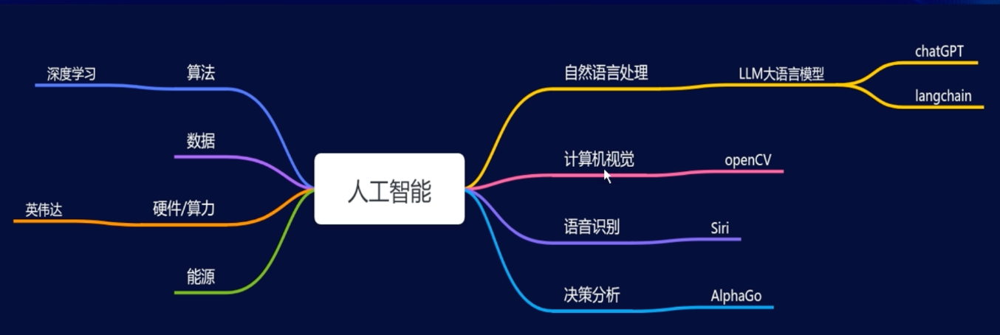
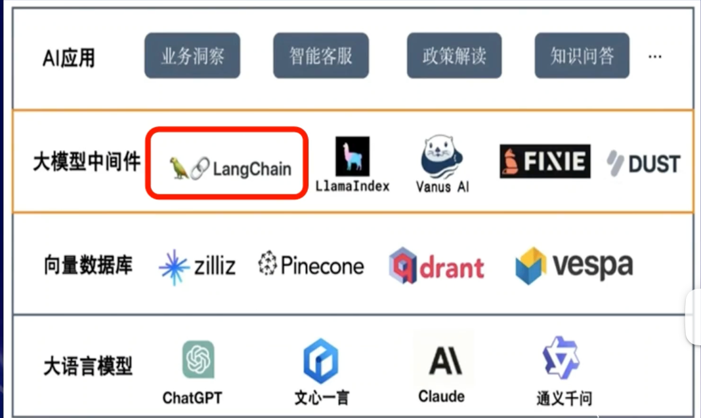
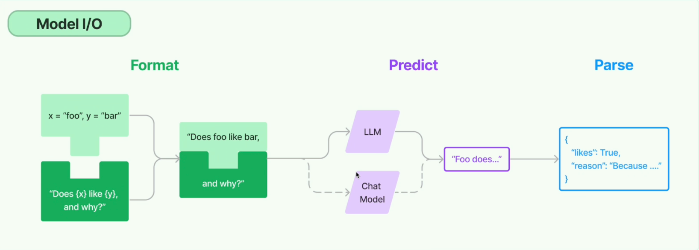

# 人工智能的构成和类别

# 大语言模型的生态架构

# langchain六大模块

## models（模型）

> langchain支持各种模型类型和模型集成

Llm:纯文本场景

chat model：对话场景

## Prompts（提示词）

> 包括提示管理、提示优化和提示序列化

## Memory（记忆）

> 内存是在链/代理调用之间保持状态的概念，langchain提供了一个标准的内存接口，一组内存实现及使用内存的链/代理示例，简而言之就是让模型记住上下文

## Indexs（索引）

> 给模型预料检索

## Chains（模型链）

> 模块化，各个模块组合在一起实现一个功能，高内聚低耦合。

### 基础链结构

#### llm chain单链

#### router chain并行多链

#### sequential chain串行多链

#### transformation chain文本处理链

### 应用链结构 

#### document chains

#### retrieval qa

## agent
