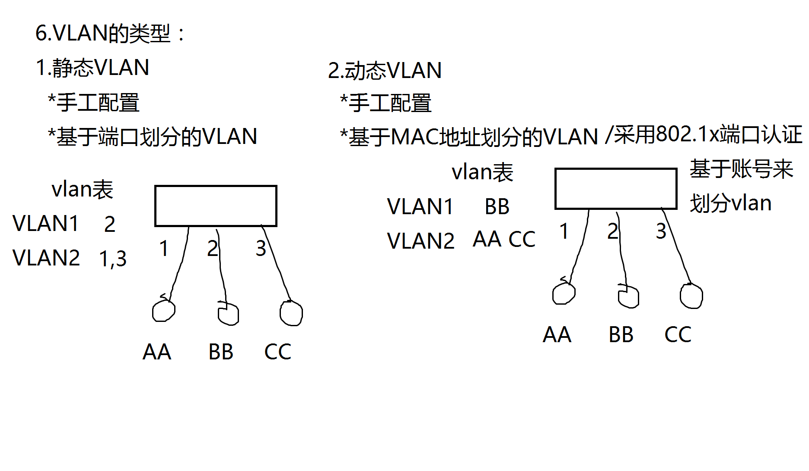

OSI模型

> OSI七层模型
>
> TCP/IP协议族（其实就是OSI五层模型，最常使用）
>
> OSI四层模型（不流行，未被使用）

# 一、应用层

> 应用层将数据编码后（表示层完成的）传给传输层

## DHCP

> 减少工作量，避免IP冲突，提高地址利用效率
>
> DHCP设计几个名词（IP，子网掩码，网关，DNS，续租）

相关概念

> DHCP服务器：动态分配IP的一个服务器
>
> 保留：为某个mac地址专门保留IP，也就是说，某个mac连接始终使用一个IP

工作流程

```
1. 客户机发送DHCP Discovery广播包
2. DHCP服务器响应DHCP Offer广播包（服务器响应提供IP地址，但无子网掩码，网关等参数）
3. 客户机发送DHCP Request广播包（确认使用那个IP，带过去）
4. 服务器发送DHCP ACK广播包（服务器确定了续约，并提供IP的详细信息等）
```

相关攻击以及防御

```
攻击：冒充DHCP服务器攻击真实的客户机  防御：交换机上做动态mac绑定
攻击：冒充客户机攻击真实的DHCP服务器	防御：交换机上静止所有接口转发dhcp offer包，除真实的dhcp服务器所在接口外
```

## DNS

> https://www.cnblogs.com/linhaifeng/articles/5937962.html#_label19

```
几个概念：
	正向解析：根据域名解析到IP
	反向解析：根据IP解析到域名

	客户机域名请求顺序：本地缓存-> hosts -> 本地DNS服务器
	DNS服务器亲请求顺序：缓存-> 本地区域解析 -> 转发器 -> 根
```

## FTP

```
主动模式：
	20端口：数据传输
	21端口：访问控制

被动模式：
	20端口：数据传输
	随机端口：访问控制
```

# 二、传输层

> 提供端口到端口的通信
>
> 端口：联网的程序都有端口
>
> 传输层协议：TCP、UDP
>
> TCP：传输数据可靠，传输数据前会建立链接，也就是通道，但是速度不如UDP
>
> - 可靠：按顺序地传送数据，确认是否收到，没收到就重传
> - 流量控制：发送方不会淹没接收方
> - 拥塞控制：当网络拥塞时，发送方会降低发送速率
>
> UDP：无连接，传输数据不会建立通道，速度快
>
> - 无连接
> - 不可靠传输数据
> - 无流量控制
> - 无拥塞控制

# 三、网络层

> - 虚电路服务
> - 数据报服务，网络层使用数据报服务
>
> 提供点到点的通信（PC或者router）

## 路由器

> 数据怎样通过网络进行传输?
>
> 路由器根据路由表选择下一跳ip或者接口
>
> 三种通信方式:
>
> - 电路交换（电话通信是典型的电路交换，一旦通话，必须断开才能与其他人通话，电路建立都需要好长时间，所以不适合计算机通信，计算机具有突发性，一会看电影，一会浏览网页，一时间要访问多个服务器，类比下来，就不能使用电路交换，若要连续传送大量的数据，且其传送时间远大于连接建立时间，则电路交换的传输速率较快。）
> - 分组交换
> - 报文交换
>
> 报文交换和分组交换不需要预先分配传输带宽，在传送突发数据时可提高整个网络的信道利用率。
>
> 由于一个分组的长度往往远小于整个报文的长度，因此分组交换比报文交换的时延小，同时也具有更好的灵活性

```
路由器的工作原理
1）一个帧到达路由器，·首先检查目标MAC地址是否自己，如果不是则丢弃，如果是则解封装，并将IP包送到路由器内部

2）路由器检查IP包头中的目标IP，并匹配路由表，如果匹配失败，则丢弃，并向源IP回馈错误信息，如匹配成功，则将IP包路由到出接口。

3）封装帧，首先将出接口的MAC地址作为源MAC封装好，然后检查ARP缓存表，检查是否有下一跳的MAC地址，如有，将提取并作为目标MAC地址封装到帧中，如没有，则发送ARP广播请求下一跳的MAC，并获取到对方的mac地址，再记录缓存，并封装帧，最后将帧发送出去。
```

分组交换

> 分组交换采用的是存储转发技术
>
> - 将要传送的数据分成一个个单位:
>
>   分组
> - 将分组从一个路由器传到相邻路由 器(hop)，一段段最终从源端传 到目标端
> - 每段:采用链路的最大传输能力( 带宽)
>
> 分组的存储转发一段一段从源端传到目标端，按照有无网络层的连接，分成:
>
> - 数据报网络:
>
>   分组的目标地址决定下一跳
>   在不同的阶段，路由可以改变
>
>   类似:问路
>   Internent
> - 虚电路网络
>
>   每个分组都带标签(虚电路标识 VC ID)，标签决定下一跳
>
>   在呼叫建立时决定路径，在整个呼叫中路径保持不变
>
>   路由器维持每个呼叫的状态信息
>
>   X.25 和ATM

## IP

### 公有地址

### 私有地址

> 私有地址是从ABC类，每一类都抽一点，抽出来的

```
A类：10.0.0.0/8 （10开头的）
B类：172.16.0.0/16 - 172.31.0.0/16（172.16-172.31）
C类：192.168.0.0/16（192.168开头的）
```

## **ARP**

> 地址解析协议，通过ip地址获取mac地址

```
=====广播与广播域=====
广播：将广播地址做为目的地址的数据帧
广播域：网络中能接收到同一个广播所有节点的集合

MAC地址广播
广播地址为FF-FF-FF-FF-FF-FF

IP地址广播
1）255.255.255.255
2）广播IP地址为IP地址网段的广播地址，如192.168.1.255/24


ARP协议讲解：
1.地址解析协议
2.作用：将IP解析为MAC地址
3.原理：1）发送ARP广播请求
	ARP报文内容:我是10.1.1.1 我的mac：AA
                    谁是10.1.1.3 你的mac：？
        2）接收ARP单播应答
  
4.ARP攻击或欺骗的原理是：
  通过发送伪造虚假的ARP报文（广播或单播），来实现的攻击或欺骗！
  如虚假报文的mac是伪造的不存在的，实现ARP攻击，结果为中断通信/断网！
  如虚假报文的mac是攻击者自身的mac地址，那就实现了ARP欺骗，结果可以监听、窃取、篡改、控制流量

5.ARP协议没有验证机制，所以容易被arp投毒攻击

6.ARP攻击者通过发送虚假伪造的arp报文对受害者进行ARP缓存投毒


8.如果公司有人在做ARP欺骗，该如何找到此人？
```

**防御**

```
ARP攻击防御：
1.静态ARP绑定
  手工绑定/双向绑定
  windows客户机上：
  arp -s 10.1.1.254  00-01-2c-a0-e1-09 
  arp -a  查看ARP缓存表
  路由器上静态绑定：
Router(config)#arp 10.0.0.95 0013.240a.b219 arpa f0/0
优点：配置简单
缺点：工作量大，维护量大

2.ARP防火墙
  自动绑定静态ARP
  主动防御
  优点：简单易用
  缺点：当开启人数较多时，会增大网络负担

3.硬件级ARP防御：
  交换机支持“端口”做动态ARP绑定（配合DHCP服务器）
  或做静态ARP绑定

  如：
  conf t
  ip dhcp snooping
  int range f0/1 - 48
  switch(config-range-if)#
```

## NAT

> 网络地址转换，解决IP不够用问题，一般是在路由器或防火墙上面完成
>
> NAT有三类：
>
> - 静态NAT
> - 动态NAT
> - PAT（基于端口的地址转换）

# 四、数据链路层

> 数据链路层的数据叫帧

## 交换机

> 收到帧后，根据帧中源mac来形成mac地址表，然后根据帧中的目标mac地址匹配mac表，表中存在匹配项：单播转发，表中不存在匹配项：广播转发

```
29.为交换机配置管理IP:
  conf t
  int vlan 1
    ip add 10.1.1.253 255.255.255.0
    no shut
30.为交换机配置默认网关：
   目的：可被跨网段管理！
  conf t
  ip default-gateway 10.1.1.254
```

**帧格式**


> 由于，下层为上层提供服务，所以我们只考虑数据链路层该干些什么，数据链路层协议有许多种，但有三个是共同的
>
> **封装成帧**：必须规定特殊的字符作为帧定界符(前后一个)，不然不知道那里是数据，那里是以太网头部
>
> **透明性**：必须保证传输规程透明，假如以**为帧定界符，要是数据里面也有\*\*，后果自己想象
>
> **差错控制**：能够对接收端收到的帧进行校验，丢掉有错的帧

**封装成帧**

> 对上层传来的ip数据包加上帧头和帧尾用以区别哪些数据归一组，但是又衍生出一个问题，如果传输的数据中含有帧头的或者帧尾的二进制代码，那后果不堪设想，透明传输就是封装成帧带来的这个问题

**透明传输**

> - 字节填充：用于同步网络
> - 字符填充：用于异步网络

**差错控制**

> 数据传输过程中有可能会被不可预知因素改变比特的值，0变为1，1变为0
>
> 为了保证数据传输正确，通常采用检错技术：循环冗余检验CRC
>
> 余数为0不代表一定传输过程没有出现差错，也有可能出现差错后误打误撞余数为0，仅用循环冗余检验CRC差错检测技术只能做到无差错接受
>
> 无差错接受：凡是接受的帧，我们都以趋于1的概率认为传输过程中没有出现差错
>
> **CRC并不能做到可靠传输(不重复，不丢失，不失序)，它只能检测收到的帧是否正确**

```
假设待发送比特流：m = 101110
p(x) = x^3 + 1 = 1*x^3 + 0*x^2 + 0*x^1 + 1*x^0
提取前面的系数为则：p = 1001
假设p有n位数就加在待发送数据后面加n个0：101110 000
101110 000除以 p， 每个位置求异或，算出来的余数FCS为011
那么就发送101110 011过去，对方接受到，利用101110 011除以 1001整除余数为0，那就是对的，没有出现差错
```

## vlan

> 虚拟局域网，交换机从逻辑上给连接的pc进行划分，默认所有连接在交换机上的pc，vlan id都为1
>
> 如下图所示（图中的vlav1、vlan2就是vlan的id，一个id是一个虚拟局域网），vlan有两种类型
>
> - 静态vlan：端口在同一个vlan中才可以相互通信，例如1、3端口在vlan2中可以相互通信，vlan1中的2无法与1、3通信
> - 动态vlan
>
> 通信流程：假如AA往CC发信息，交换机拿到数据包后判断这个包是从哪个端口来，到哪个端口去，从1端口到3端口，看vlan表，1、3端口在同一个vlan，然后再匹配mac地址表，完后通信



## trunk

> 默认设置的vlan只能在一个交换机上通信，如果需要跨交换机通信，那就需要以trunk模式连接交换机
>
> Trunk(中继)模式可以传输多个vlan流，允许用户将vlan从一台交换机扩展到多个交换机

# 五、物理层

> 考虑怎么样才能在传输媒体上传输比特流
>
> 作用是尽可能的屏蔽掉不同传输媒体和通信手段差异

### 信号

> 电信号
>
> - 模拟信号：WiFi，电话线就是传输的模拟信号
> - 数字信号：抗干扰能力强，传输距离短，高低电平，高电平代表1，低电平代表0
>
> 光信号
>
> - 光纤

### 导引型传输媒体

```
双绞线
    屏蔽双绞线
    非屏蔽双绞线
  
    1.直通线：两端都是568B标准线序，适用于不同种设备
    2.交叉线：一端是568B另一端是568A标准线序，适用于同种设备
    3.全反线：
    4.不过，随着网络技术的发展，目前一些新的网络设备，可以自动识别连接的网线类型，用户不管采用直通网线或者交叉网线均可以正确连接设备。
    5.保证两端线序一一对应也是可以的，不过会导致抗干扰性差， 网速慢等原因
  
 同轴电缆
 光纤
 	1.多模光纤：传输更多优先选
 	2.单模光纤：传输更远优先选
```

# 杂货

## 协议

```
对等层如果要通信使用那种规则来进行通信，例如http协议

协议的三要素：

	语法 ：什么规则组成的协议，比如，http协议请求由请求首行，请求头，请求体构成

	语义：这个协议表达什么意思，比如http协议请求一个网页

	时序：双方通信必须遵守某种顺序，比如http协议，只有先建立tcp连接或者udp才可以发请求
```

## B与b

```
100MB与100mb

B：字节，Byte
b：比特，bit
```

## 原、反、补码

> 注意：计算机中数值运算只有加法运算，只认识加法,为了满足人类其他法则,计算机存储的都是补码

```
(1000 0001)2进制 --> +1
(0000 0001)2进制 --> -1
第一位表示符号，叫做符号位，其他位叫做真值位
```

**反码**

```
正数的反码是其本身
负数的反码是在其原码的基础上，符号位不变，其余各个位取反

[+1] = [00000001]原 = [00000001]反
[-1] = [00000001]原 = [00000001]反
```

**补码**

```
正数的补码就是本身
负数的补码就是在原码的基础上，符号位不变,其余各各位取反，最后加+1(即在反码上加1)
我自己认为补码出现的意义：把减法换算成加法，有利于运算，这样CPU处理速度就更快

假设要计算 +1 + (-1) 这里我们求出补码，直接用补码相加，溢出的直接不要，然后结果就为0，如果不用补码相加，用原码相加，很麻烦

[+1] = [00000001]原 = [00000001]反 = [00000001]补
[-1] = [10000001]原 = [11111110]反 = [11111111]补

```

# VPN

引入：可以实现在不安全的网络上，安全的传输数据，很像专网，是一个技术，使用PKI技术来保证数据安全的三要素

翻墙也是VPN技术中的一个分支技术

# 防火墙